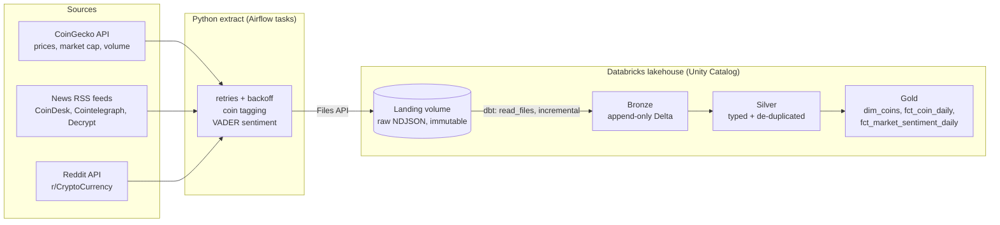

# Crypto Market & Sentiment Data Pipeline

An end-to-end batch data pipeline that combines **crypto market data** with **news and Reddit sentiment** in a **Databricks lakehouse**.

Python extractors pull from three sources, land raw files in a Unity Catalog volume, and **dbt** builds a medallion
model (bronze → silver → gold) on **Delta Lake**, with data-quality tests at every layer. **Airflow** schedules the
pipeline every 6 hours, running in **Docker**.


## Architecture



```
Airflow DAG (every 6h):   extract_coingecko ─┐
                          extract_news ──────┼──▶ dbt_build (run + test all layers)
                          extract_reddit ────┘
```

## Tech stack

| Layer | Tools |
|---|---|
| Extraction | Python, `requests` (retry/backoff session), `feedparser`, VADER sentiment |
| Storage | Databricks Unity Catalog volume (landing), Delta Lake tables |
| Transformation | dbt (`dbt-databricks`), Databricks SQL warehouse |
| Orchestration | Apache Airflow 3 (standalone, Docker) |
| Quality | dbt data tests, pytest unit tests, ruff, GitHub Actions CI |

## Data model

| Layer | Model | Grain | Notes |
|---|---|---|---|
| Bronze | `bronze_coin_markets` | row per coin per extraction run | Append-only raw data plus file lineage (`_source_file`, `_ingested_at`, `_run_id`) |
| Bronze | `bronze_news_articles` | row per article x matched coin per run | |
| Bronze | `bronze_reddit_posts` | row per post x coin per run | Optional, see [Reddit access](#reddit-access) |
| Silver | `silver_coin_market_snapshots` | coin x CoinGecko update | Typed; duplicates from overlapping runs removed |
| Silver | `silver_news_articles` | article x coin | First sighting kept (articles stay in feeds across runs) |
| Silver | `silver_reddit_posts` | post x coin | Latest score and comment count kept |
| Gold | `dim_coins` | coin | Latest attributes, first-seen date |
| Gold | `fct_coin_daily` | coin x day | Closing price, 1-day change, market cap, news and Reddit volume and sentiment |
| Gold | `fct_market_sentiment_daily` | feed x day | Market-wide news sentiment, including untagged articles |

**Tests** (run by `dbt build`): uniqueness of every silver and gold grain, not-null keys, referential integrity
(`fct_coin_daily` → `dim_coins`), sentiment scores within [-1, 1], accepted sentiment labels, and price range checks.

## Design decisions

- **Immutable landing zone.** Each run writes a new NDJSON file (`<source>/<date>/<source>_<run_id>.json`) and never
  overwrites, so the raw layer is a replayable history. Bronze can be rebuilt from scratch with `dbt build --full-refresh`.
- **Incremental bronze, idempotent silver.** Bronze uses `read_files()` and only loads files it hasn't seen
  (tracked by `_metadata.file_path`). Silver removes duplicates with window functions, so re-running a DAG or landing
  overlapping data never double counts.
- **Explicit schemas.** Bronze reads each source with a fixed schema instead of type inference, so upstream API
  changes cannot silently change column types.
- **Failure isolation.** Each source is its own Airflow task with retries. One dead RSS feed or failed coin search
  is logged and skipped. The HTTP session retries 429 and 5xx responses with exponential backoff and honours `Retry-After`.
- **Dependency isolation.** The pipeline and dbt run in their own virtualenv inside the Airflow image, so dbt's
  dependencies can't conflict with Airflow's.
- **Coin tagging.** News is tagged by coin name (case-insensitive) or ticker (upper-case whole word). Tickers under 3
  characters are ignored to avoid false matches such as "S".

## Getting started

### 1. Databricks (Free Edition works)

1. Sign up for [Databricks Free Edition](https://www.databricks.com/learn/free-edition).
2. Create a personal access token: **Settings → Developer → Access tokens**.
3. Open **SQL Warehouses → your warehouse → Connection details** and copy the **Server hostname** and **HTTP path**.

### 2. Configure

```bash
git clone https://github.com/Harry-01/Crypto-data-pipeline.git
cd Crypto-data-pipeline
cp .env.example .env        # fill in DATABRICKS_* and (optionally) COINGECKO_API_KEY, REDDIT_*
python -m venv .venv && source .venv/bin/activate
make install
```

### 3. Run

```bash
make setup           # create <catalog>.crypto_raw schema + landing volume (idempotent)
make extract         # land raw files for all sources in Databricks
make dbt-build       # build bronze -> silver -> gold and run all tests
```

Develop without Databricks with `make extract-local`, which writes the same files to `./data/landing`.

### 4. Schedule with Airflow

```bash
make airflow         # docker compose up --build  ->  http://localhost:8080
```

Turn on the `crypto_pipeline` DAG. It runs every 6 hours.

### Reddit access

Reddit now requires approval for new API apps. If you don't have credentials, set `ENABLE_REDDIT=false`. The Reddit
task and models are then disabled, and the Reddit columns in `fct_coin_daily` stay at zero or null.

## Example query

```sql
-- Does news sentiment line up with next-day price moves?
select
    coin_id,
    market_date,
    close_price_usd,
    news_articles,
    round(news_sentiment_avg, 3)                                    as news_sentiment,
    round(lead(price_change_pct_1d) over (partition by coin_id order by market_date) * 100, 2)
                                                                    as next_day_change_pct
from workspace.crypto_gold.fct_coin_daily
where news_articles > 0
order by market_date desc, news_articles desc;
```

## Project structure

```
crypto_pipeline/
  extract/            coingecko.py, news.py, reddit.py
  load/landing.py     local + Databricks volume writers
  http.py             retrying HTTP session
  sentiment.py        VADER scoring
  __main__.py         CLI: setup | extract
dbt/
  models/bronze|silver|gold
  macros/landing.sql  read_files() helpers and source schemas
  tests/generic/      custom tests (unique_combination, value_between)
airflow/dags/         crypto_pipeline_dag.py
tests/                pytest unit tests (APIs mocked)
Dockerfile, docker-compose.yml, Makefile, .github/workflows/ci.yml
```

## Testing

```bash
make test     # unit tests: parsing, pagination, dedupe, tagging, landing, CLI failure handling
make lint
cd dbt && dbt parse --profiles-dir .   # validates models without a warehouse (also runs in CI)
```

## Next steps

- Build an AI/BI dashboard in Databricks on top of the gold tables
- Add dbt source freshness checks and alerting on stale sources
- Replace the rule-based VADER sentiment with a finance-tuned model (such as FinBERT) using a Databricks job
